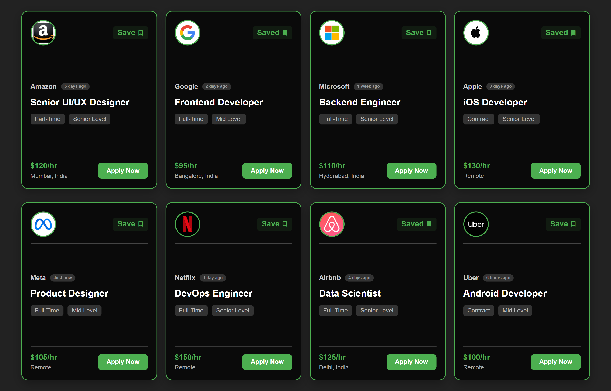
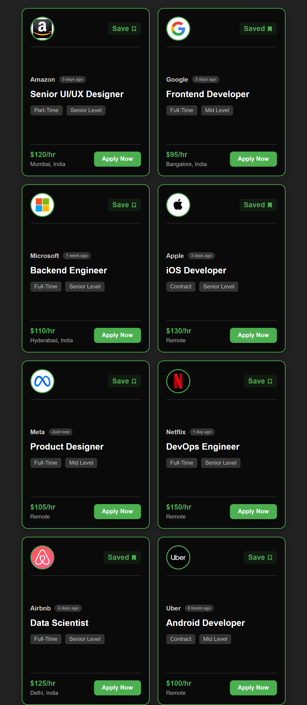

# Day 13 - Job Board Application

## Project Preview

### Desktop View

### Mobile View

## Project Overview
A responsive job board interface displaying multiple job cards with interactive bookmark functionality.

## Key Features
- Dynamic job card generation from JavaScript data
- Bookmark toggle functionality (Save/Unsave jobs)
- Responsive design using Flexbox and CSS Grid
- Hover effects and smooth transitions
- Mobile-responsive layout

## Files Structure
day-13/
├── index.html        - Main HTML structure
├── style.scss        - Styling with SCSS
├── style.css         - Compiled CSS
└── script.js         - JavaScript functionality

## Technologies Used
- HTML5
- SCSS/CSS3
- Vanilla JavaScript
- Remix Icons
- Base64 encoded images

## Core Functionality

### HTML Structure
- Semantic HTML5 elements
- Linked external stylesheets and scripts
- Remix Icons integration

### SCSS/Styling
- CSS reset with box-sizing
- Responsive card layout
- Dark theme with green accent (#4CAF50)
- Hover animations and transitions
- Mobile-first responsive design

### JavaScript Features
1. Job Data Array: Array of job objects with properties:
    - id, companyLogo, companyName, jobTitle
    - postedTime, jobType, experienceLevel
    - salary, location, isBookmarked, tags

2. Dynamic Rendering:
    - Creates job cards from data array
    - Displays bookmark status dynamically

3. Bookmark System:
    - Toggle save/unsave functionality
    - Updates UI and data state
    - Persistent icon changes (ri-bookmark-line/fill)

## Responsive Design
- Flexbox and CSS Grid layouts
- Mobile breakpoints (max-width: 480px)
- Flexible card sizing with max-width constraints
- Stacked layout on mobile devices

### Card Styling Features
- Gradient backgrounds with dark theme
- Border and shadow effects
- Hover animations (translateY, scale)
- Typography hierarchy with font sizes

## Learning Outcomes
- DOM manipulation with JavaScript
- Event handling and state management
- CSS transitions and animations
- Responsive web design principles
- SCSS nesting and organization
- Array methods for data manipulation

## Browser Compatibility
- Modern browsers with ES6 support
- Responsive across desktop and mobile devices
- No external dependencies required

## How to Use
1. Open index.html in a web browser
2. Browse job cards with company details
3. Click "Save" button to bookmark jobs
4. Click again to remove bookmark
5. Responsive layout adjusts to screen size