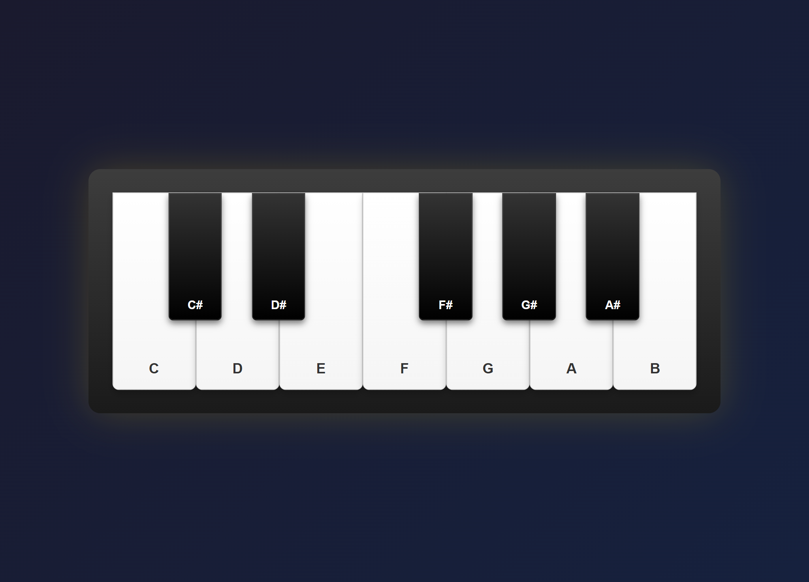

# Day 14 - Digital Piano Application

## Daily Progress
- **[Day 14 - Digital Piano](https://shekgit.github.io/JS-Practice/day-14/)** - Interactive Piano Simulator
- - **Interactive Piano Interface** - Realistic piano keys with click and keyboard support, audio playback, visual feedback animations

## Project Preview

### Desktop View


## Project Overview
A fully functional digital piano web application simulating real piano keys with dual input methods and realistic sound effects.

## Key Features
- **7 White Keys & 5 Black Keys** - Full octave piano representation
- **Dual Control Methods** - Mouse click and keyboard shortcuts (ASDFGHJ + WETYU)
- **Real Piano Sounds** - High-quality MP3 samples for each note
- **Visual Feedback** - Key press animations with scale and opacity effects
- **Responsive Design** - Centered interface with gradient backgrounds
- **Audio Caching** - Pre-loaded audio for instant playback
- **3D Visual Effects** - Realistic shadows, gradients, and depth simulation

## How to Use
1. **Mouse Play**: Click on white keys (C, D, E, F, G, A, B) or black keys (C#, D#, F#, G#, A#)
2. **Keyboard Play**: Use keys A, S, D, F, G, H, J for white notes and W, E, T, Y, U for black notes
3. **Visual Feedback**: Keys will depress and light up when played
4. **Audio Playback**: Each key plays corresponding piano note sound

## Files Structure
```
JS-Practice/
├── day-14/
│   ├── index.html           - Main HTML structure
│   ├── style.scss          - SCSS styling with nested rules
│   ├── style.css           - Compiled CSS file
│   └── script.js           - JavaScript functionality
├── sounds/                  - Audio files for piano notes (parent level)
│   ├── piano-mp3_C4.mp3
│   ├── piano-mp3_Db4.mp3
│   └── ... (all 12 note files)
└── ... (other day folders)
```

## Technologies Used
- HTML5 Semantic Elements
- SCSS/CSS3 with Advanced Gradients
- Vanilla JavaScript (ES6+)
- Web Audio API
- CSS Transitions & Animations
- 3D Box Shadows and Effects
- Responsive Flexbox Layout
- Data Attributes for Note Mapping
- Event Handling (click, keydown)
- Audio Pre-loading and Caching

## Learning Outcomes
- DOM Event Handling (click and keyboard events)
- Web Audio API Integration
- CSS 3D Effects and Gradient Styling
- Nested SCSS Architecture
- Event Propagation Control
- Data Attribute Usage for Dynamic Content
- Responsive Centering Techniques
- Audio File Management and Playback
- Visual Feedback Animations
- Keyboard Mapping Systems

## Browser Compatibility
- Modern Browsers with Web Audio Support
- Desktop Focus with Keyboard Input
- Mobile Touch Compatible
- No External Dependencies Required

## Setup Instructions
1. Ensure all audio files are in `/sounds/` directory
2. Open `index.html` in any modern web browser
3. Click piano keys or use keyboard to play notes
4. Adjust system volume as needed

## Interactive Features
- **Click to Play**: Mouse interaction on all keys
- **Keyboard Shortcuts**: ASDFGHJ for white keys, WETYU for black keys
- **Visual Animations**: Scale transform and opacity changes on key press
- **Audio Feedback**: Real piano sounds for each note
- **Error Handling**: Graceful audio playback failure management

## Notes for Developers
- Audio files in MP3 format for compatibility
- Black keys positioned absolutely within white keys
- Keyboard mapping follows standard piano layout
- Event.stopPropagation() prevents nested key conflicts
- Audio objects cached for performance
- CSS uses modern features without fallbacks