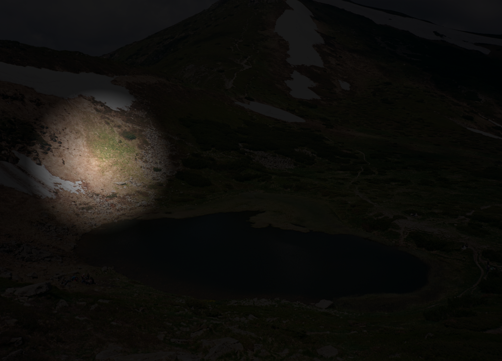
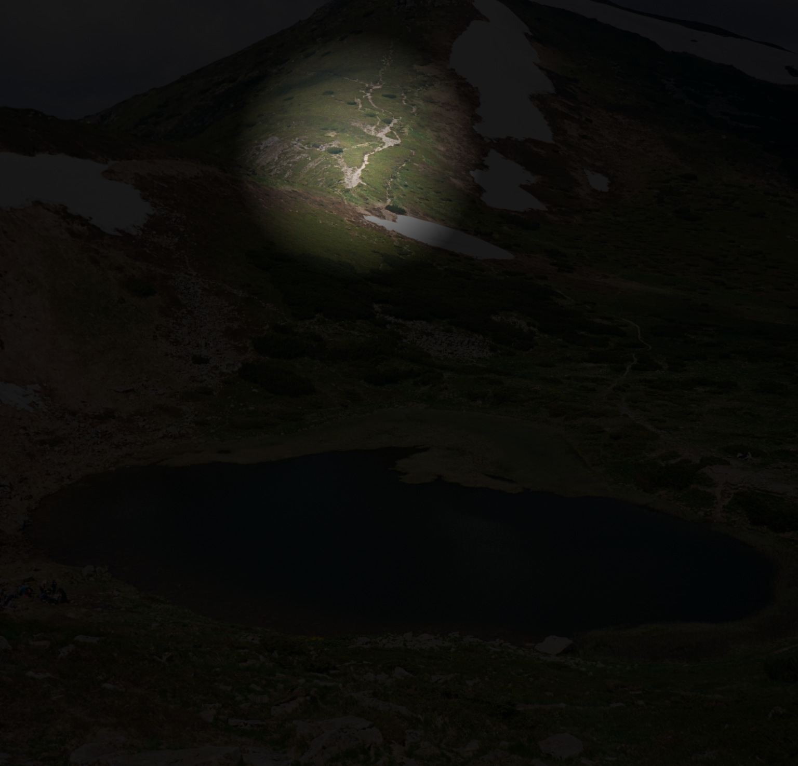

# Day 15 - Spotlight Effect Application

## Daily Progress
- **[Day 15 - Spotlight Effect](https://shekgit.github.io/JS-Practice/day-15/)** - Interactive Mouse Spotlight Effect
- **Interactive Spotlight** - Follows mouse/touch movement with smooth transitions, responsive design for all devices

## Project Preview

### Desktop View

### Mobile View

## Project Overview
An interactive visual effect that creates a spotlight following mouse/touch movement, revealing portions of a background image with smooth transitions.

## Key Features
- **Mouse & Touch Tracking** - Works on both desktop (mouse) and mobile (touch) devices
- **Responsive Spotlight** - Adapts size based on screen width (150px desktop / 120px mobile)
- **Smooth Transitions** - 0.1s CSS transition for fluid spotlight movement
- **Customizable Colors** - CSS variables for easy color customization
- **Performance Optimized** - Lightweight JavaScript with efficient event handling
- **Full Viewport Coverage** - Works on any screen size with overflow control
- **No External Dependencies** - Pure HTML, CSS, and JavaScript

## How to Use
1. **Desktop**: Move mouse cursor anywhere on screen - spotlight follows cursor position
2. **Mobile**: Touch and drag on screen - spotlight follows finger movement
3. **Background**: Uses a high-quality Pexels image (customizable)
4. **Effect**: White circular spotlight reveals image against dark overlay

## Files Structure
JS-Practice/
├── day-15/
│ ├── index.html - Main HTML structure with mobile viewport
│ ├── style.scss - SCSS styling with CSS variables and media queries
│ ├── style.css - Compiled CSS file
│ └── script.js - JavaScript for mouse/touch tracking
├── img/ - Screenshots for documentation (parent level)
│ ├── spotlight-desktop.png
│ └── spotlight-mobile.png
└── ... (other day folders)

## Technologies Used
- HTML5 with Mobile Viewport Meta Tag
- SCSS/CSS3 with CSS Custom Properties (Variables)
- Vanilla JavaScript (ES6+)
- CSS Radial Gradients for Spotlight Effect
- CSS Transitions for Smooth Animation
- Media Queries for Responsive Design
- Event Handling (mousemove, touchmove, touchstart)
- CSS Positioning (absolute, relative)
- Object-fit for Background Image Control
- Mobile-First Responsive Approach

## Learning Outcomes
- CSS Custom Properties (Variables) Implementation
- Mobile Touch Event Handling
- CSS Radial Gradient Creation
- Responsive Design with Media Queries
- Mouse and Touch Coordinate Tracking
- Performance Optimization for Animation
- Cross-Device Compatibility Testing
- Viewport Meta Tag Configuration
- SCSS Nesting and Structure
- Event Listener Management

## Browser Compatibility
- All Modern Browsers (Chrome, Firefox, Safari, Edge)
- Desktop with Mouse Support
- Mobile/Tablet with Touch Support
- iOS and Android Devices
- No JavaScript Framework Dependencies

## Setup Instructions
1. Place all files in `day-15/` directory
2. Compile SCSS to CSS: `sass style.scss style.css`
3. Open `index.html` in any modern web browser
4. Move mouse or touch screen to see spotlight effect
5. To change background image, update URL in `style.scss`

## Interactive Features
- **Mouse Movement Tracking**: Real-time cursor position detection
- **Touch Event Support**: Mobile drag interaction
- **Responsive Spotlight**: Size adjustment based on screen width
- **Smooth Animation**: CSS transition for natural movement
- **Customizable Variables**: Easy color and size modification
- **Background Control**: Any image can be used as background

## Customization Options
Modify these CSS variables in `style.scss`:
- `--spotlight-size`: Spotlight diameter (150px desktop / 120px mobile)
- `--primary-radial`: Inner glow color (rgba(255, 255, 255, 0.2))
- `--secondary-radial`: Outer fade color (rgba(0, 0, 0, 0.9))

---
Created as a daily web development challenge project - Day 15