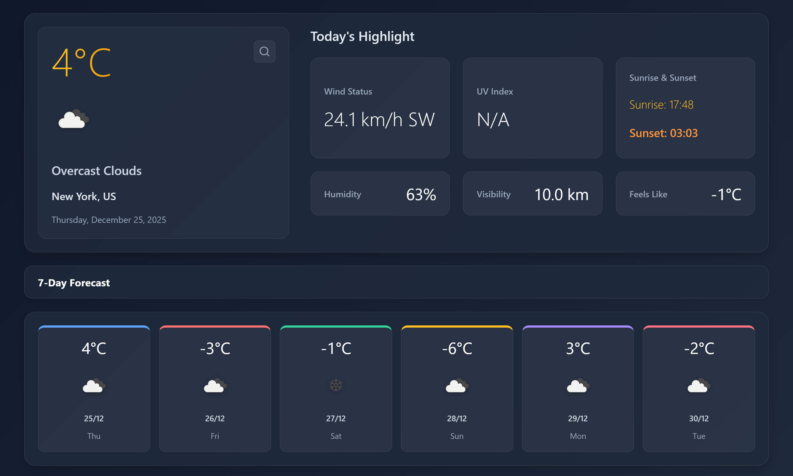
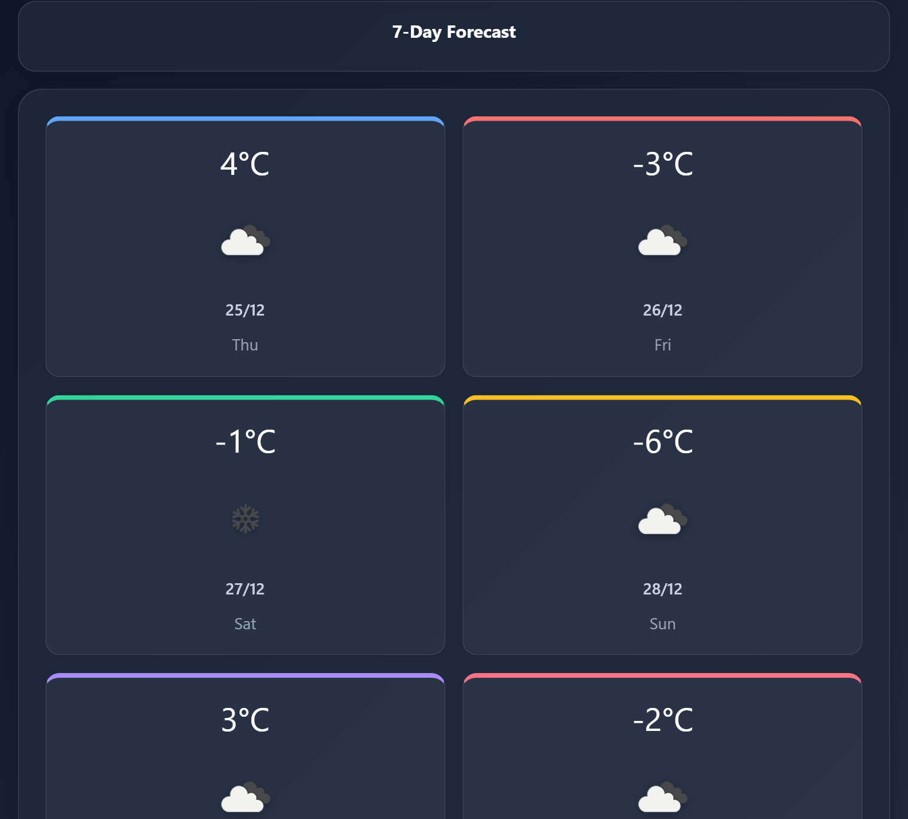

# Day 19 - Weather Dashboard App

## Project Preview

### Desktop View


### Mobile View


## Project Overview
A fully responsive weather dashboard application built with HTML, SCSS, and JavaScript. Features real-time weather data from OpenWeatherMap API with geolocation support and interactive UI.

## Key Features
- **Live Weather Data** - Current temperature, humidity, wind speed, visibility
- **7-Day Forecast** - Daily weather predictions with icons
- **Geolocation** - Auto-detects user's location on page load
- **City Search** - Search any city worldwide with expandable search bar
- **Weather Icons** - Real OpenWeatherMap icons for different conditions
- **Responsive Design** - Optimized for mobile, tablet, and desktop
- **Interactive UI** - Hover effects, smooth transitions, loading states

## How It Works
1. **Page Load** - Detects user location via browser geolocation
2. **API Integration** - Fetches data from OpenWeatherMap API
3. **Dynamic Updates** - Updates UI with current weather and forecast
4. **Search Functionality** - Allows searching any city with instant results
5. **Responsive Layout** - Adapts to different screen sizes automatically

## Technologies Used
- **HTML5** - Semantic markup structure
- **SCSS/CSS3** - Advanced styling with variables and mixins
- **JavaScript ES6+** - Modern JavaScript with async/await
- **OpenWeatherMap API** - Real-time weather data
- **Remix Icons** - Icon library for UI elements
- **CSS Flexbox/Grid** - Responsive layouts

## Learning Outcomes
- Working with third-party APIs (OpenWeatherMap)
- Implementing geolocation in web applications
- Building responsive weather applications
- Handling async operations with JavaScript
- Creating interactive search functionality
- Implementing loading states and error handling
- Designing data-rich dashboards
- Working with real-time data updates

## Setup Instructions
1. **Open index.html** in a modern web browser
2. **Allow location access** when prompted for local weather
3. **Search cities** by clicking the search icon
4. **Test responsive design** by resizing browser
5. **View forecast** - 7-day weather predictions with icons

## API Integration Details
- Uses OpenWeatherMap API for weather data
- Free tier API key implementation
- Handles both current weather and 5-day forecast
- Converts units (metric/imperial) as needed
- Error handling for invalid cities/network issues

## Performance Features
- **Lazy Loading** - Icons load on demand
- **CSS Animations** - Smooth transitions and hover effects
- **Efficient API Calls** - Caches data where possible
- **Responsive Images** - Weather icons scale appropriately
- **Minimal DOM Updates** - Targeted UI refreshes
- **Error Recovery** - Falls back to default city on errors

## Challenges Faced & Solutions
- Challenge: Handling geolocation permission denial
- Solution: Fallback to default city (Delhi)

- Challenge: API rate limiting
- Solution: Implemented error handling and user feedback

- Challenge: Responsive weather icons
- Solution: Used OpenWeatherMap's responsive icon system

## File Structure
```
day-19/
├── index.html          # Main HTML structure
├── style.scss          # SCSS styles with responsive design
├── style.css           # Compiled CSS
├── script.js           # JavaScript functionality
└── README.md           # This documentation
```

## Browser Support
- Chrome 60+
- Firefox 55+
- Safari 12+
- Edge 79+
- Mobile browsers (iOS Safari, Chrome for Android)


## Credits
- Weather data provided by [OpenWeatherMap](https://openweathermap.org/)
- Icons by [Remix Icon](https://remixicon.com/)
- Design inspired by modern weather applications

## License
Educational project for learning web development