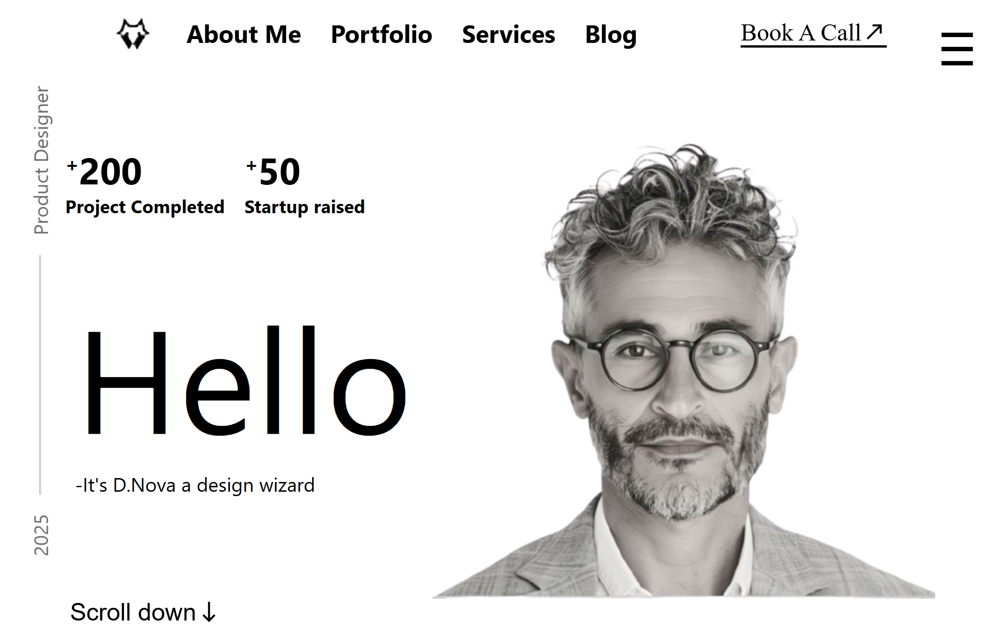
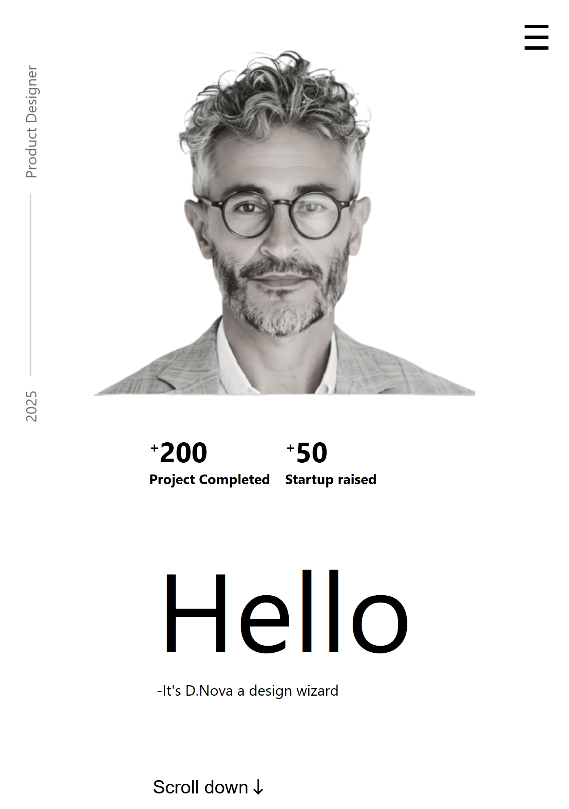

# Day 20 - Responsive Portfolio Website

## Project Preview

### Desktop View

### Mobile View

## Project Overview
A fully responsive portfolio website built with React and SCSS featuring mobile-first design and dynamic components.

## Key Features
- Responsive navbar with mobile hamburger menu
- Fixed sidebar with vertical design element
- Hero section with project statistics
- Mobile menu with toggle functionality
- Dynamic year display in sidebar
- Scroll lock on mobile menu open

## How It Works
1. React components for modular architecture
2. SCSS for responsive styling with media queries
3. JavaScript for mobile menu toggle logic
4. Dynamic positioning of sidebar based on screen size
5. CSS flexbox and grid for layouts

## Technologies Used
- React (without JSX)
- SCSS/CSS3
- JavaScript ES6+
- HTML5
- CSS Media Queries
- CSS Flexbox

## Learning Outcomes
- Building React components with createElement
- Responsive design with SCSS media queries
- Mobile-first development approach
- Dynamic JavaScript for UI interactions
- CSS positioning for fixed elements
- Mobile menu implementation

## Setup Instructions
1. Open index.html in browser
2. Resize browser to test responsive behavior
3. Click hamburger icon on mobile view
4. Observe sidebar positioning changes

## Performance Features
- CSS will-change for animation optimization
- Efficient React rendering
- Mobile-responsive images
- Scroll performance optimization
- Minimal DOM manipulation