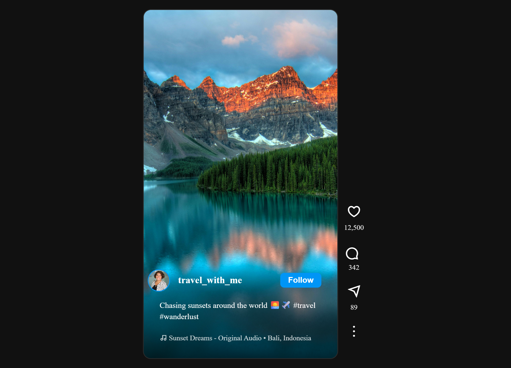
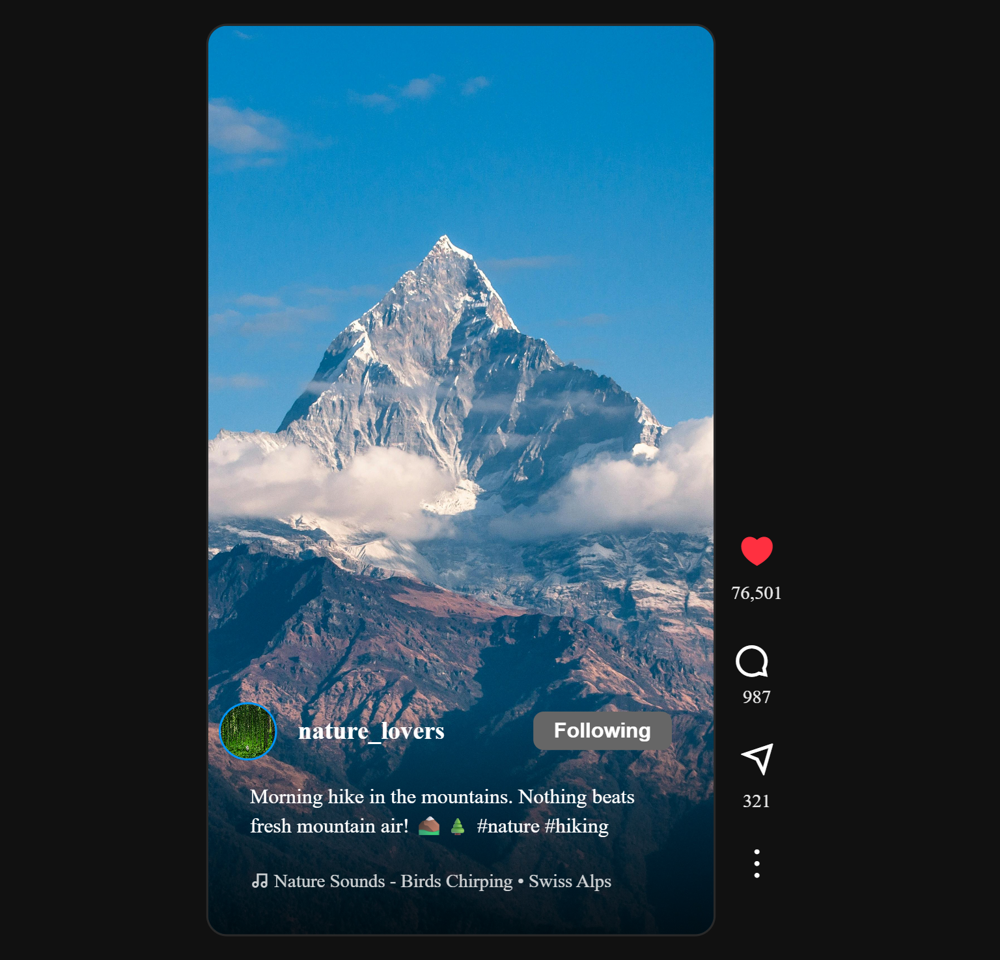

# Day 21 - Instagram Style Reels Clone

## Project Preview

### Desktop View


### Mobile View


## Project Overview
An Instagram style vertical video reels interface with interactive features, built with vanilla JavaScript and SCSS. Features include like, comment, share functionality, follow/unfollow system, and smooth vertical scrolling.

## Key Features
- **Vertical Reels Interface**: Instagram-style fullscreen vertical reels with snap scrolling
- **Interactive Stats Panel**: Like, comment, share, and menu buttons with hover effects
- **Follow/Unfollow System**: Toggle follow status with visual feedback (blue/gray buttons)
- **Real-time Like Updates**: Click heart icon to like/unlike with counter updates
- **Responsive Design**: Mobile-first responsive layout with optimal viewing on all devices
- **Dynamic Content Loading**: JavaScript-generated reels from data array
- **Pointer Event Management**: Smart CSS-based click handling (icons only, not counts)

## How It Works
1. **Data Structure**: Reels data stored in JavaScript array with properties for each reel
2. **Dynamic Rendering**: `addReels()` function generates HTML for each reel from data
3. **Event Delegation**: Separate event listeners for like, comment, share, follow, and menu actions
4. **CSS Pointer Control**: Advanced `pointer-events` CSS to restrict clicks to icons only
5. **State Management**: DOM-based state updates without complex frameworks
6. **Scroll Behavior**: CSS scroll-snap for smooth vertical scrolling between reels

## Technologies Used
- **HTML5**: Semantic markup for reels structure
- **SCSS/CSS3**: Advanced styling with variables, nesting, and responsive design
- **JavaScript ES6+**: Vanilla JavaScript for dynamic functionality
- **Remix Icons**: Icon library for UI elements
- **CSS Scroll Snap**: Native browser scrolling behavior
- **CSS Gradients**: Visual effects for text overlays

## Code Architecture
```
project/
├── index.html          # Main HTML structure
├── style.scss          # SCSS styles with responsive design
├── script.js           # JavaScript for all functionality
└── README.md           # Project documentation
```

## Core Components
### 1. Reel Container
- Fullscreen vertical video/image display
- User info overlay with profile picture and follow button
- Caption and music information
- Gradient overlay for better text readability

### 2. Stats Panel
- Like button with heart icon (filled/unfilled states)
- Comment button with rotated icon
- Share button
- Menu button
- Real-time counter updates

### 3. User Interface
- Follow/Unfollow toggle with color feedback (blue/gray)
- Hover effects on interactive elements
- Smooth transitions and animations
- Clean, minimalist design

## Learning Outcomes
### CSS/SCSS Skills
- Advanced `pointer-events` usage for click control
- CSS scroll-snap for vertical scrolling
- CSS gradients for overlay effects
- Responsive design with viewport units (vh)
- CSS transitions and hover effects
- BEM-like naming conventions

### JavaScript Skills
- Dynamic DOM manipulation with `innerHTML`
- Event delegation and target management
- Array manipulation and data rendering
- State management without frameworks
- Number formatting with `toLocaleString()`
- String parsing and manipulation

### UX/UI Principles
- Mobile-first responsive design
- Intuitive gesture-based interface
- Visual feedback for user interactions
- Performance optimization with CSS
- Accessibility considerations

## Setup Instructions
1. **Clone or Download** the project files
2. **Open `index.html`** in any modern web browser
3. **Interact with the reels**:
    - Scroll vertically to navigate between reels
    - Click heart icon to like/unlike
    - Click comment/share icons
    - Click follow button to follow/unfollow users
    - Hover over icons for scale effects

4. **Test Responsive Behavior**:
    - Resize browser window to test mobile/desktop views
    - Use developer tools device emulation

## Performance Features
- **CSS Optimization**: Efficient selectors and minimal repaints
- **JavaScript Efficiency**: Event delegation reduces listeners
- **Image Optimization**: `object-fit: cover` for consistent aspect ratios
- **Scroll Performance**: Hardware-accelerated CSS transforms
- **Memory Management**: No memory leaks with proper event handling

## Browser Support
- Chrome 80+ ✓
- Firefox 75+ ✓
- Safari 13+ ✓
- Edge 80+ ✓

## Future Enhancements
1. Video playback support
2. Double-tap to like gesture
3. Infinite scroll with lazy loading
4. Comment modal/dialog
5. Share dialog with social media options
6. Save/bookmark functionality
7. User authentication system
8. Backend API integration


## Credits
- **Images**: Pexels (royalty-free stock photos)
- **Icons**: Remix Icon by Jimmy Cheung
- **Design Inspiration**: Instagram Reels, TikTok
- **Color Scheme**: Instagram-inspired dark mode

---

**Note**: This is a frontend-only demonstration project. All data is static and for UI/UX demonstration purposes only.