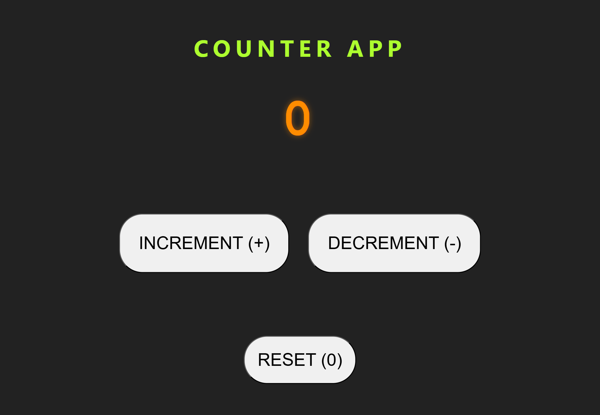
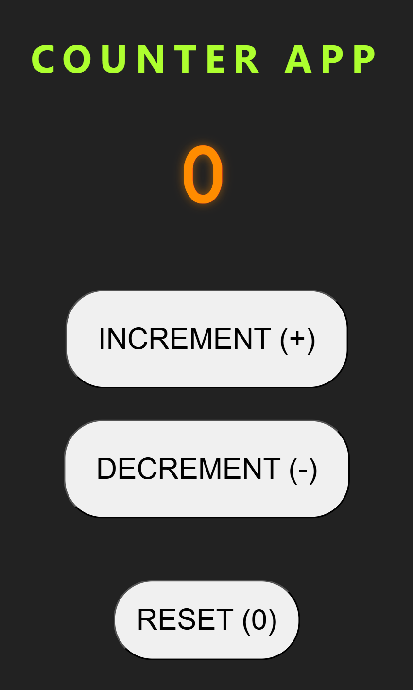

# Day 5 - DOM Counter Application

## Project Preview

### Desktop View

### Mobile View

*Modern dark theme counter application with responsive design*

## Project Overview
A modern, responsive counter web application built using HTML, CSS, and JavaScript DOM manipulation.

## Features
- Increment counter value
- Decrement counter value (with non-negative validation)
- Reset counter to zero
- Responsive design for mobile and desktop
- Smooth hover animations and transitions
- Modern dark theme interface

## Technical Implementation

### HTML Structure
- Semantic HTML5 with main and section elements
- Properly structured counter display and control sections
- Accessible button labels and text content

### CSS Styling
- Modern dark color scheme (#222 background)
- Responsive grid and flexbox layouts
- System font stack for optimal performance
- Smooth CSS transitions and transform effects
- Mobile-first responsive design approach
- Custom hover states for interactive elements

### JavaScript Functionality
- DOM element selection using querySelector
- Event listener implementation for button interactions
- Number parsing and validation
- Real-time DOM content updates
- Non-negative value protection

## Key Concepts Practiced
- DOM Manipulation and Element Selection
- Event Handling and Click Events
- CSS Grid and Flexbox Layouts
- Responsive Web Design Principles
- CSS Transitions and Transformations
- JavaScript Number Operations
- Modern CSS with SCSS-like Nesting
- Mobile-First Development Approach

## File Structure

day-5/
├── index.html
├── style.css
├── script.js
├── counter-1.png
└── counter-2.png

## How to Use
1. Open `index.html` in a web browser
2. Click the Increment button to increase the counter
3. Click the Decrement button to decrease the counter
4. Click the Reset button to set counter back to zero
5. The counter will not go below zero

## Browser Compatibility
Compatible with all modern browsers including:
- Chrome 60+
- Firefox 55+
- Safari 12+
- Edge 79+