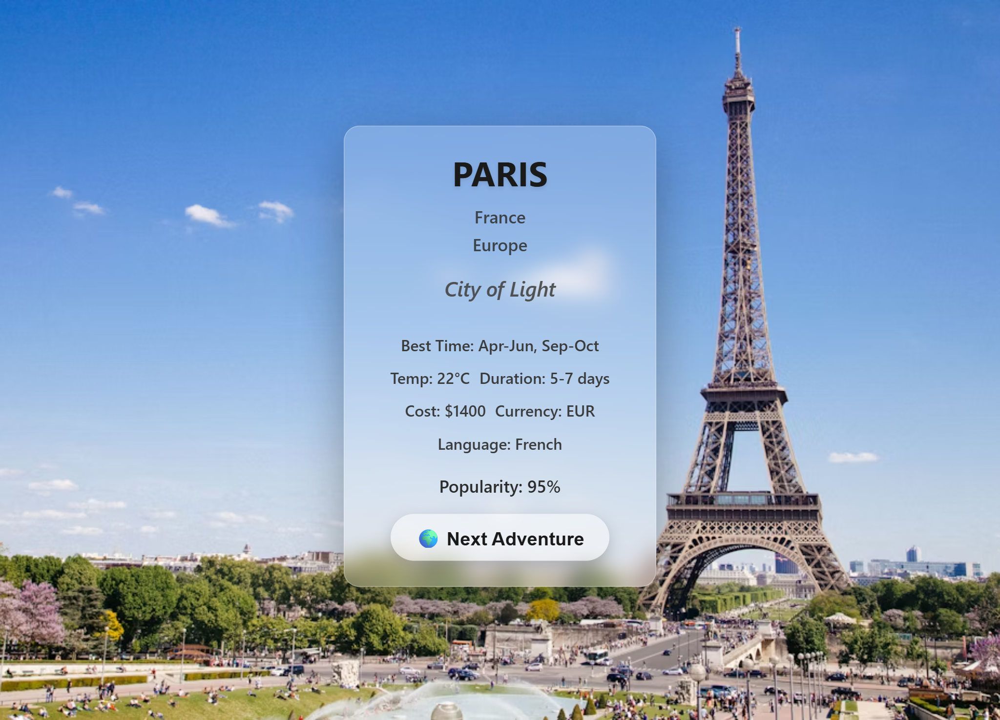
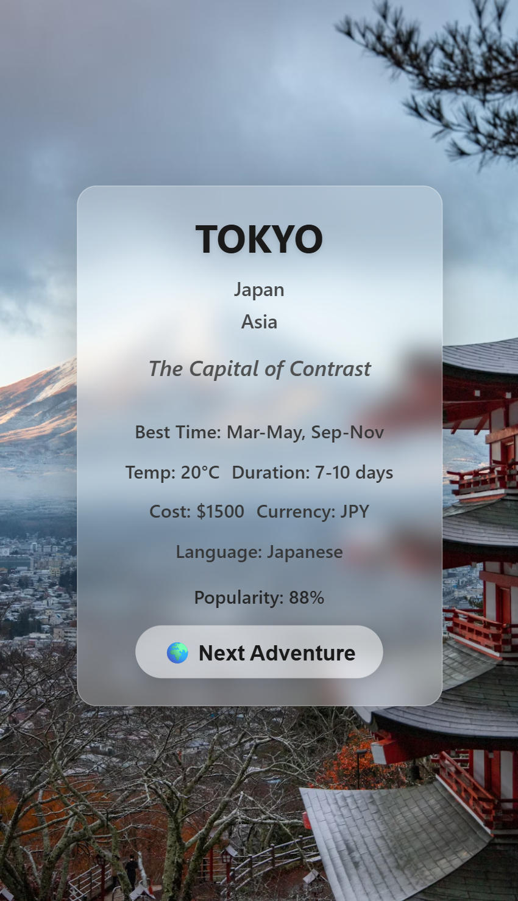

# Day 6 - Travel Destination Explorer

## Project Preview

### Desktop View

### Mobile View

*Modern travel destination explorer with glass morphism design*

## Project Overview
An interactive travel destination explorer that randomly displays beautiful travel spots around the world with stunning background images and detailed information.

## Features
- Random destination generator with "Next Adventure" button
- Dynamic background images for each destination
- Glass morphism card design with backdrop filters
- Responsive design for all devices
- Smooth hover animations and transitions
- Detailed travel information (cost, weather, visa, etc.)
- Modern color scheme with excellent readability

## Technical Implementation

### HTML Structure
- Semantic HTML5 with main and section elements
- Organized card layout with multiple information lines
- Properly structured destination details sections
- Accessible button and text content

### CSS Styling (SCSS)
- Advanced glass morphism effects with backdrop-filter
- Responsive flexbox layouts
- System font stack for optimal performance
- Smooth CSS transitions and transform effects
- Mobile-first responsive design approach
- Custom hover states for interactive elements
- Color schemes optimized for readability over images

### JavaScript Functionality
- DOM element selection using querySelector
- Event listener implementation for button interactions
- Random destination selection from curated dataset
- Dynamic background image updates
- Real-time DOM content updates
- Comprehensive travel data management

## Key Concepts Practiced
- DOM Manipulation and Dynamic Content Updates
- Event Handling and Click Events
- Advanced CSS Glass Morphism Effects
- Responsive Web Design Principles
- CSS Transitions and 3D Transformations
- JavaScript Array Operations and Random Selection
- Modern CSS with SCSS-like Nesting
- Background Image Handling and Optimization
- Mobile-First Development Approach

## File Structure

day-6/
├── index.html
├── style.css
├── script.js
├── travel-1.png
└── travel-2.png

## Dataset Features
- 20+ curated travel destinations worldwide
- Comprehensive information for each destination:
    - Name, tagline, country, continent
    - Best travel time and duration
    - Cost in local currency
    - Temperature and weather information
    - Visa requirements and local language
    - Popularity rating
    - High-quality Unsplash images

## How to Use
1. Open `index.html` in a web browser
2. Click the "🌍 Next Adventure" button to discover random destinations
3. View detailed travel information for each destination
4. Enjoy the dynamic background images that change with each destination
5. Hover over elements to see interactive effects

## Browser Compatibility
Compatible with all modern browsers including:
- Chrome 60+
- Firefox 55+
- Safari 12+
- Edge 79+

*Note: Glass morphism effects require modern browsers with backdrop-filter support*