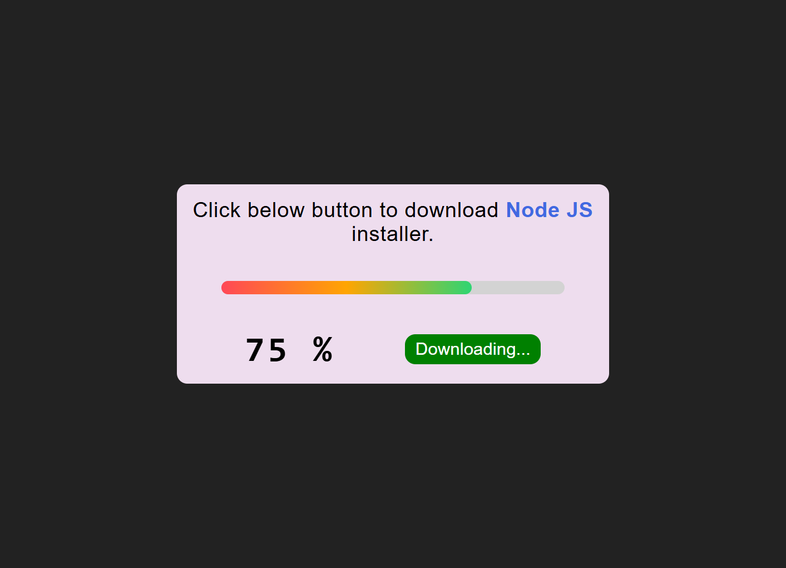

# Download Progress Simulator

A responsive download progress simulator with realistic loading animation and modern UI design.

## Project Preview

### Desktop View

## Features
- Realistic Progress Simulation - Smooth loading animation with random speeds
- Gradient Progress Bar - Dynamic color transition (Red to Orange to Green)
- Fully Responsive - Works perfectly on desktop, tablet, and mobile
- Interactive UI - Hover effects and button states
- Lightweight - Pure HTML, CSS, and JavaScript

## Tech Stack
- HTML5
- SCSS/CSS3
- JavaScript (ES6)

## File Structure
download-progress-simulator/
├── index.html
├── style.scss
├── style.css
└── script.js

## How to Use
1. Click the "Download Now" button
2. Watch the progress bar fill with gradient colors
3. Observe the percentage counter update in real-time
4. Button states change automatically during the process

## Setup
1. Clone the repository
2. Open index.html in your browser
3. Start simulating downloads!

## Responsive Design
- Desktop: Full layout with side-by-side elements
- Tablet (<=768px): Adaptive width
- Mobile (<=576px): Stacked column layout

## Code Overview

### HTML Structure
- Main card container with download information
- Progress bar with outer and inner elements
- Percentage display and download button

### SCSS Features
- CSS variables for consistent styling
- Nested selectors for better organization
- Media queries for responsive design
- Gradient backgrounds and transitions

### JavaScript Functionality
- Random interval generation for realistic simulation
- Progress bar width animation
- Dynamic button state management
- Event listeners for user interaction

---

Perfect for practicing JavaScript intervals, CSS animations, and responsive design concepts!