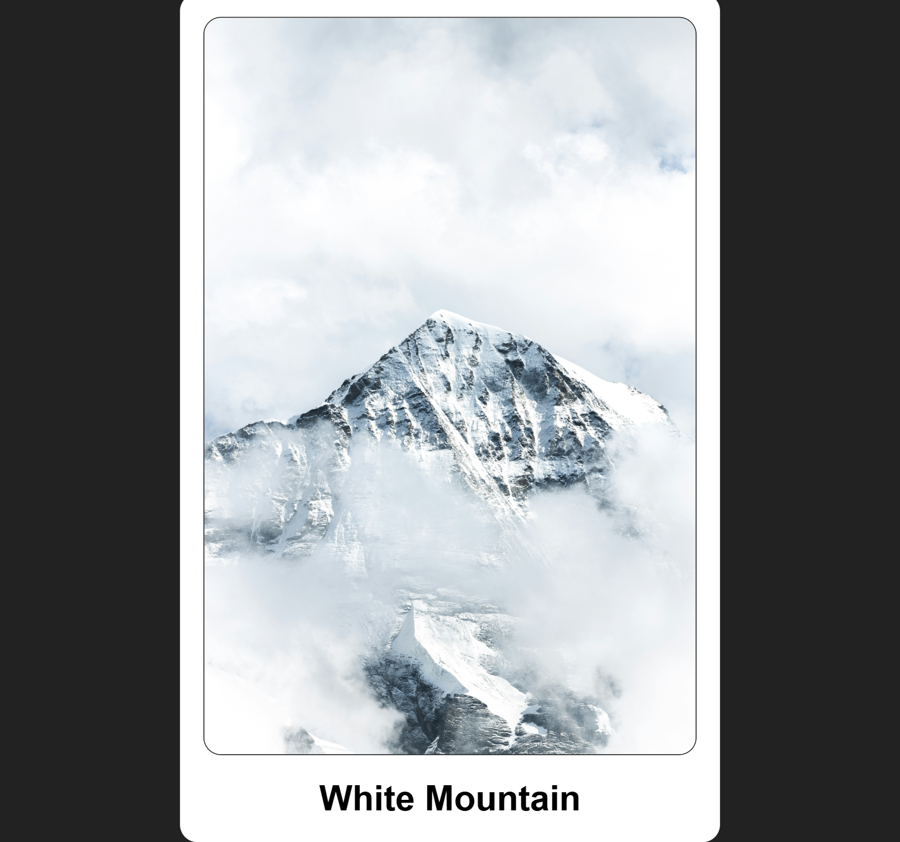
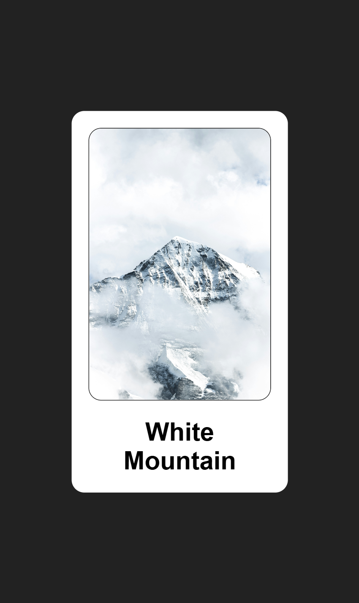

# Instagram Like Animation

A beautiful Instagram-style double-tap like animation with gradient heart effect and smooth transitions.

## Project Preview

### Desktop View

### Mobile View

## Features
- **Gradient Heart Effect** - Custom gradient-filled heart using base64 image
- **Smooth Animation** - Heart grows from scale 0.5 to 1.2, rotates 40deg, and moves upward
- **Double Click Interaction** - Image double tap triggers like animation
- **Transparent Background** - Heart background remains transparent with background-clip
- **Fully Responsive** - Responsive design for desktop, tablet, and mobile with multiple breakpoints
- **Touch-Friendly** - Optimized for mobile touch interactions
- **Modern UI Design** - Clean card layout with beautiful typography and borders

## Tech Stack
- HTML5
- SCSS/CSS3
- JavaScript (ES6)
- Remix Icons

## File Structure
instagram-like-animation/
├── index.html
├── style.scss
├── style.css
├── script.js
└── README.md

## How to Use
1. **Desktop**: Double click on the mountain image
2. **Mobile**: Double tap on the mountain image
3. Watch the heart icon appear with gradient fill
4. Observe the heart grow, rotate and move upward simultaneously
5. Heart fades out smoothly at the peak of animation

## Animation Sequence
- **Start**: Heart hidden (opacity: 0, scale: 0.5, center position)
- **On Double Click/Tap**:
    - Heart appears instantly (opacity: 1)
    - Grows from scale 0.5 to 1.2
    - Rotates 40 degrees clockwise
    - Moves upward with responsive distances
    - All animations happen simultaneously over 0.6s
- **Fade Out**: Opacity reduces to 0 at 300ms mark
- **Reset**: Returns to original state after animation completion

## Project Files Overview

### index.html
- Semantic HTML structure with main and section elements
- Remix Icons CDN for heart icon
- Clean layout with image, title, and heart overlay
- Responsive meta tag for mobile viewport

### style.scss
- CSS reset with box-sizing
- Responsive typography (62.5% base font-size)
- Gradient heart using base64 background image
- Smooth transitions and transform animations
- Absolute positioning for heart overlay
- Multiple media queries for responsive animations:
    - Tablet: 768px
    - Small mobile: 550px
    - Extra small mobile: 450px
- Mobile-optimized animations and spacing

### script.js
- Double click/tap event listener on image
- CSS class manipulation for animation triggers
- Transition end event handling for cleanup
- Opacity control with precise timing (300ms fade)
- Cross-platform event handling

## Key Technical Implementation

### CSS Techniques
- `background-clip: text` for gradient text effect
- `transform: scale(), rotate(), translate()` for complex animations
- `transition: all 0.6s ease` for smooth multi-property transitions
- `position: absolute` with centering using translate
- Base64 encoded background images
- Multiple media queries for responsive animations

### JavaScript Features
- Event delegation for double click/tap detection
- CSS classList API for animation control
- transitionend event for animation completion
- setTimeout for precise fade timing
- Cross-browser compatibility

### Responsive Animation Properties
- **Duration**: 600ms total animation across all devices
- **Fade Timing**: 300ms opacity transition
- **Scale**: 0.5 → 1.2 (140% growth) on all devices
- **Rotation**: 0deg → 40deg on all devices
- **Movement**:
    - Desktop: -23rem vertical translation
    - Tablet: -30rem vertical translation
    - Small Mobile: -22rem vertical translation
    - Extra Small Mobile: -10rem vertical translation

### Media Query Breakpoints
- `@media (max-width: 768px)` - Tablet optimization
- `@media (max-width: 550px)` - Small mobile optimization
- `@media (max-width: 450px)` - Extra small mobile optimization

## Browser Support
- Chrome (recommended)
- Firefox
- Safari
- Mobile Safari
- Chrome Mobile

---

Perfect for learning advanced CSS animations, JavaScript event handling, responsive design with multiple breakpoints, and creating engaging social media-style interactions across all devices!